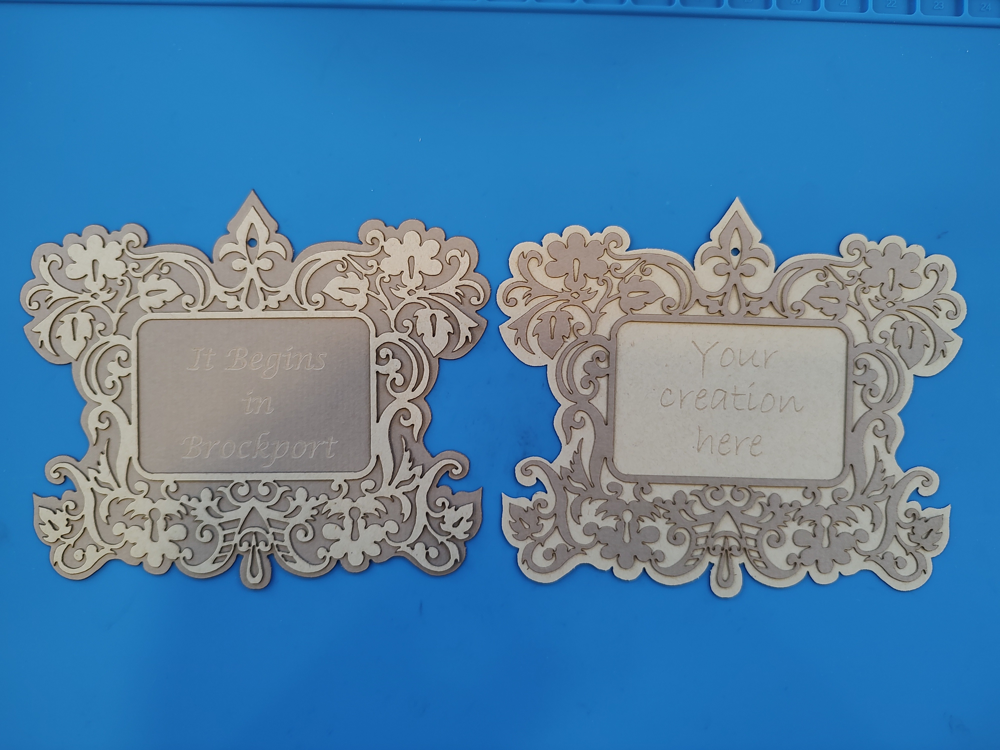

# How to use the vine artwork demo

*Note:* I forgot to note the source files and will update if I can find them again.

# Idea

This artwork works very well with cardboard. The vector carves very precisely and when using multiple colors of cardboard, results in an attractive product.

# Steps

Open the vine-art.ai file and find the three layers corresponding to the vector vine, vector outline and engraved text. When all three layers are visible, it is possible to size and position the text so that it will appear properly in the frame.

Load a piece of 3 mm cardboard into the laser cutter and send the vine vector (hide the frame and text layers) to the RetinaEngrave printer. Set the laser to the appropriate settings (currently speed 100, power 30) and print.

Load a new piece of 3mm cardboard (a different color is recommended) into the laser cutter. Be sure the frame stroke is yellow so that it can be eaisly removed from the engraving step. Send the frame and text layers (hide the vine layer) to the RetinaEngrave printer.

Engrave the text first by setting the power to 29 (can probably go higher) the speed to 100 and the threshold to 165 so the frame is not visible to the engraver. Print this piece. Then, without moving the paper, switch to the vector tab, adjust the vector parameters to spee 100 and power 30. Print the vector. 

Some post processing is necessary on the vine to remove bits that are stuck to the artwork; however this should not be too difficult with a small pointy object (I used a small scredriver) and some tweezers. The final product should look something like .

